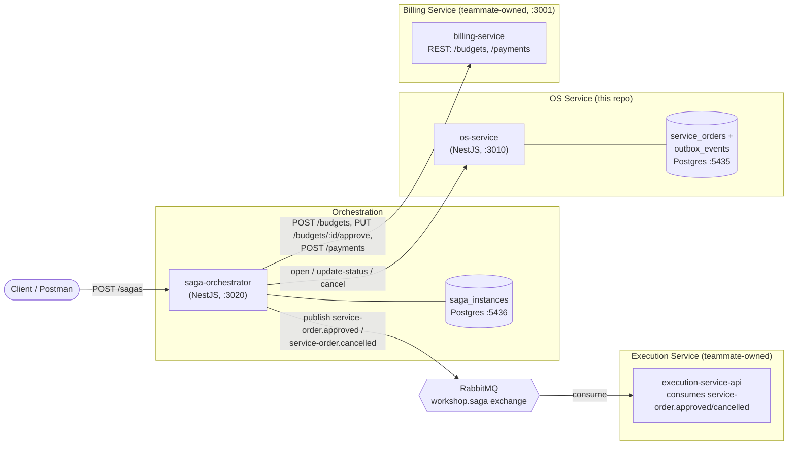
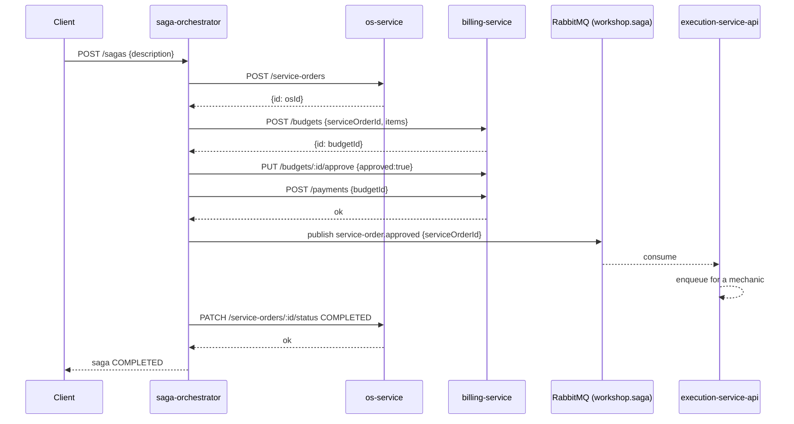
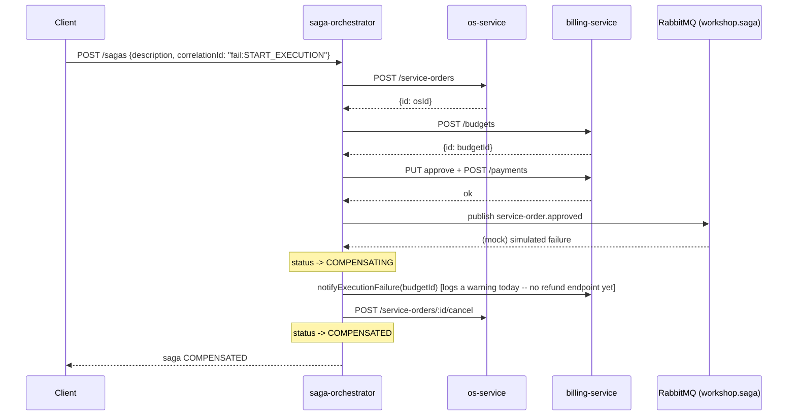

# Architecture — OS Service & Saga Orchestrator

Scope owned in this repo: **OS Service** (`os-service`) and the **Saga
Orchestrator** (`saga-orchestrator`). `billing-service` and
`execution-service-api` are owned by other teams and are now implemented in
their own repos; `saga-orchestrator` talks to them for real when
`USE_MOCK_DOWNSTREAM=false`, and to in-process mocks otherwise so the saga
can still be exercised end-to-end without them running.

## Component diagram



**Note on the diagram:** the saga-orchestrator → Billing and saga-orchestrator
→ Execution edges use different transports (REST vs. AMQP) because the two
teammate services were built with different interaction styles — see
"Integration reality vs. original design" below.

## Saga strategy: Orchestrated (not Choreographed)

**Chosen: Orchestrated Saga.** A single coordinator (`saga-orchestrator`)
owns the flow definition, calls each participant with explicit commands, and
decides what to compensate when something fails.

Why orchestrated over choreographed, for this scope:

- **A single, ownable piece of business logic.** The flow (`OS → Orçamento →
  Execução`) and its compensations are the deliverable for this challenge.
  Orchestration keeps that logic in one place (`StartServiceOrderSagaUseCase`
  + `SagaCompensationService`) instead of scattered as implicit event
  reactions across three independently-owned services.
- **Explicit, inspectable state.** Every saga run is a `SagaInstance` row
  with a status and an ordered list of completed steps — `GET /sagas/:id`
  answers "where is this saga and what would be rolled back" directly.
  Choreography would require replaying/aggregating events across services to
  answer the same question.
- **No shared event bus required.** Billing and Execution are owned by other
  teams and, at the time of writing, don't exist as running services.
  Orchestration only requires each participant to expose a small HTTP
  contract (see ports below); choreography would additionally require a
  message broker and agreed event schemas across three teams before anything
  could be tested.
- **Trade-off accepted:** the orchestrator is a new coupling point and a
  potential bottleneck/SPOF. That's acceptable here because it is the
  component this delivery is explicitly responsible for building.

## The flow and its ports

`saga-orchestrator` depends on three ports (`application/ports/*.port.ts`),
each with a forward action and a compensating action:

| Step | Forward action (port method) | Compensating action |
|---|---|---|
| 1. Open OS | `OsServicePort.openServiceOrder` → `{id: osId}` | `OsServicePort.cancelServiceOrder` |
| 2. Request quote | `BillingServicePort.requestQuote` → `{budgetId}` | `BillingServicePort.cancelQuote(budgetId)` |
| 3. Confirm payment | `BillingServicePort.confirmPayment(budgetId)` | `BillingServicePort.notifyExecutionFailure(budgetId)` (refund path — payment already succeeded) |
| 4. Start execution | `ExecutionServicePort.startExecution` | `ExecutionServicePort.cancelExecution` |
| 5. Complete OS | `OsServicePort.updateStatus(COMPLETED)` | — (terminal step; a failure here still triggers steps 1-4's compensations) |

`SagaInstance` persists both `osId` and `budgetId` as they're assigned, so a
step failing three hops later still knows what to roll back.

## Integration reality vs. original design

The ports above were originally speculative (billing/execution didn't exist
yet). Now that both teams have shipped their services, two real mismatches
came up, and in both cases **saga-orchestrator adapted to the real contract
rather than asking the other team to change already-built, working
services**:

- **`billing-service` is REST-driven** — `POST /budgets` (needs
  `serviceOrderId` + line items), `PUT /budgets/:id/approve`
  (`{approved: boolean}`), `POST /payments` (needs `budgetId` +
  `paymentMethod`). It fits the orchestrated model directly.
  `HttpBillingServiceClient` calls these endpoints; `confirmPayment` does the
  approve-then-pay as two calls under one port method.
  - **Known gap:** billing-service has no pricing/catalog integration, so
    `requestQuote` sends a single placeholder line item built from the OS
    description (`PLACEHOLDER_UNIT_PRICE` in the client). Real pricing needs
    that team to expose a catalog, or for us to pass real items through
    `StartSagaDto`.
  - **Known gap:** billing-service has no refund/execution-failure endpoint,
    so `notifyExecutionFailure` only logs a warning today instead of calling
    out — the payment isn't actually reversed on their side yet.

- **`execution-service-api` is choreography-only** — it has no REST command
  to start or cancel an execution. It only consumes
  `service-order.approved` / `service-order.cancelled` off a `workshop.saga`
  topic exchange in RabbitMQ, and reacts autonomously (enqueue into its
  priority queue, or compensate). So `RabbitMqExecutionServiceClient`
  publishes those two events instead of making an HTTP call. The saga is
  still **orchestrated** — this orchestrator alone decides *when* to publish
  the trigger — it just uses AMQP as the transport for this one participant
  because that's the contract that already exists.
  - **Known gap:** `billing-service` publishes its own approval event
    (`budget.approved`) to a *different* exchange (`billing`) with a
    different name than what `execution-service-api` listens for. If
    anything other than `saga-orchestrator` were expected to trigger
    execution by listening to billing's events, it wouldn't work — another
    reason the orchestrator publishing the `workshop.saga` event directly,
    rather than relying on billing's event, is the safer choice here.

`OsServicePort` is implemented by `HttpOsServiceClient`, calling the real
`os-service` HTTP API. All three real adapters
(`infra/clients/http-os-service.client.ts`,
`infra/clients/http-billing-service.client.ts`,
`infra/clients/rabbitmq-execution-service.client.ts`) are used when
`USE_MOCK_DOWNSTREAM=false`; billing/execution default to in-process mocks
(`infra/mocks/*`) otherwise.

## Compensation logic

`SagaCompensationService.compensate()` is the single place rollback happens.
It inspects `SagaInstance.getCompletedSteps()` and runs the matching
compensating actions **in reverse order**, best-effort (one failing
compensation is logged, not fatal — the remaining ones still run):

1. If execution had started → cancel it.
2. If payment had been confirmed → notify billing of the execution failure
   (refund path). Otherwise, if a quote had only been requested → cancel the
   quote.
3. Always cancel the service order last, if one was opened.

If the very first step (`openServiceOrder`) fails, nothing has happened yet,
so the saga goes straight to `FAILED` with no compensation to run.

## Monitoring & tracing

Both `os-service` and `saga-orchestrator` log through
[`nestjs-pino`](https://github.com/iamolegga/nestjs-pino), wired app-wide via
`app.useLogger(app.get(Logger))` in `main.ts`. That's a deliberate,
low-infrastructure choice for this scope: no extra service to run, and
because NestJS's built-in `Logger` routes through whatever `useLogger` sets,
every existing `new Logger(ClassName.name)` call in the codebase — including
all the domain-lifecycle logs in `StartServiceOrderSagaUseCase`,
`SagaCompensationService`, and the OS use-cases — automatically becomes
structured JSON with no further changes.

**How a request gets correlated across the three hops:**

1. A client (or `saga-orchestrator` itself, if none is given) picks a
   `correlationId`.
2. `saga-orchestrator`'s `LoggerModule.forRoot({ pinoHttp: { genReqId } })`
   reads it from the `x-correlation-id` request header (minting one and
   echoing it back if absent), so every HTTP access log line for that saga
   carries the same id.
3. Every downstream call the orchestrator makes — to `os-service` over HTTP,
   to `billing-service` over HTTP, and the event published to RabbitMQ for
   `execution-service-api` — carries `x-correlation-id` (HTTP) or `eventId`
   (AMQP payload) set to that same value.
4. `os-service`'s own `genReqId` reads that same header on the way in, so its
   access logs *and* its business logs (`Service order ... opened
   (correlationId=...)`) line up with the saga that triggered them.

**What a log line looks like** (all fields are structured, not just
string-interpolated into `msg` — the interpolation is for human readability
in `msg`, but `correlationId`/`sagaId`/`osId`/`budgetId` are always present
in the message text so a `grep`/`jq` filter on any one of them reconstructs
the whole flow):

```json
{"level":30,"time":1721900000000,"pid":123,"service":"saga-orchestrator","context":"StartServiceOrderSagaUseCase","msg":"Saga 2ccd... step OPEN_OS complete (osId=os-1, correlationId=48a8...)"}
```

**Reconstructing a saga's path across both services:**

```bash
CORR=48a85132-3161-46d2-ae51-9fdfcf739440
docker compose logs saga-orchestrator os-service | grep "$CORR" | jq -r 'select(.msg) | .msg' 2>/dev/null
```

This is intentionally the "structured logs, no separate tracing backend"
tier of observability — enough to answer "what happened to saga X" from logs
alone. A follow-up would be OpenTelemetry + a trace UI (Jaeger/Tempo) for a
visual waterfall instead of grepping logs; not done here to keep the
footprint to what this scope needs.

## Sequence — happy path



## Sequence — failure and compensation



## Trying it locally

**With mocks (default, no other services needed):**

```bash
cd microservices/os-service && npm run start:dev            # terminal 1
cd microservices/saga-orchestrator && npm run start:dev     # terminal 2

# happy path
curl -X POST http://localhost:3020/api/v1/sagas \
  -H 'content-type: application/json' \
  -d '{"description":"Replace brake pads"}'

# force a compensation, e.g. at execution
curl -X POST http://localhost:3020/api/v1/sagas \
  -H 'content-type: application/json' \
  -d '{"description":"Replace brake pads","correlationId":"fail:START_EXECUTION"}'
```

**With the real billing-service and execution-service-api:** start those two
alongside `os-service`, then run `saga-orchestrator` with
`USE_MOCK_DOWNSTREAM=false` (and `BILLING_SERVICE_URL` / `RABBITMQ_URL` /
`EXECUTION_SAGA_EXCHANGE` pointed at wherever they're running — the
`docker-compose.yml` defaults assume all of them are reachable via
`host.docker.internal`).
