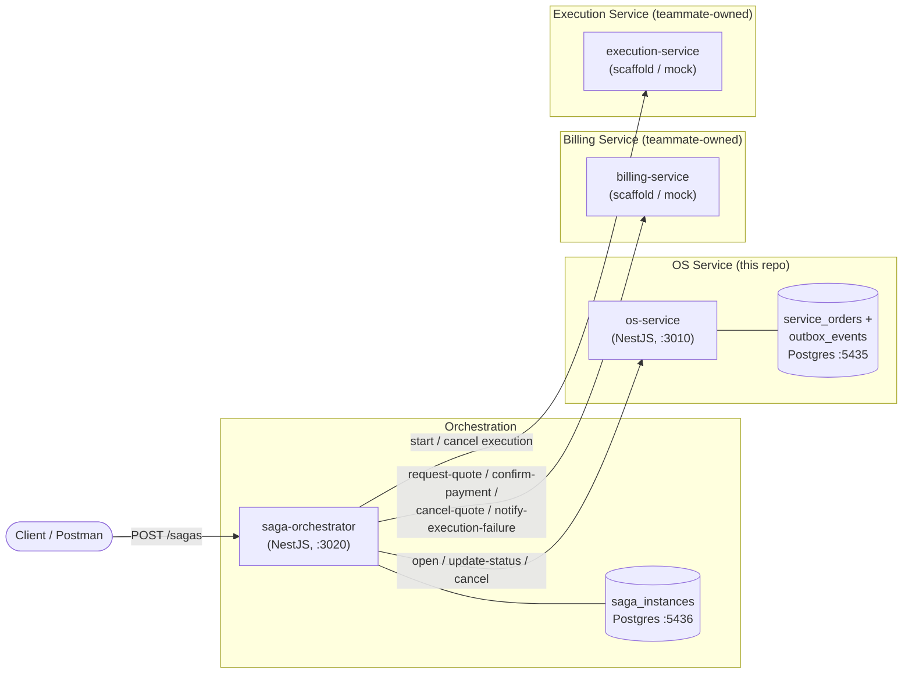
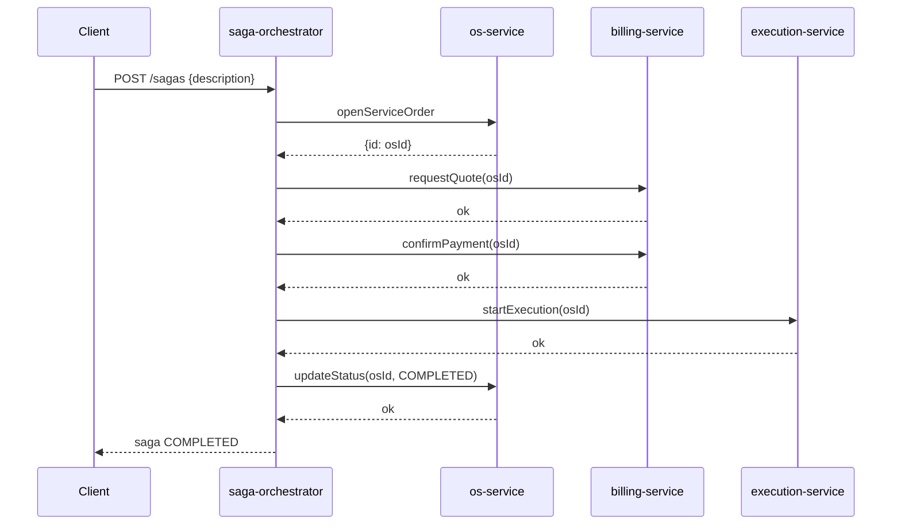
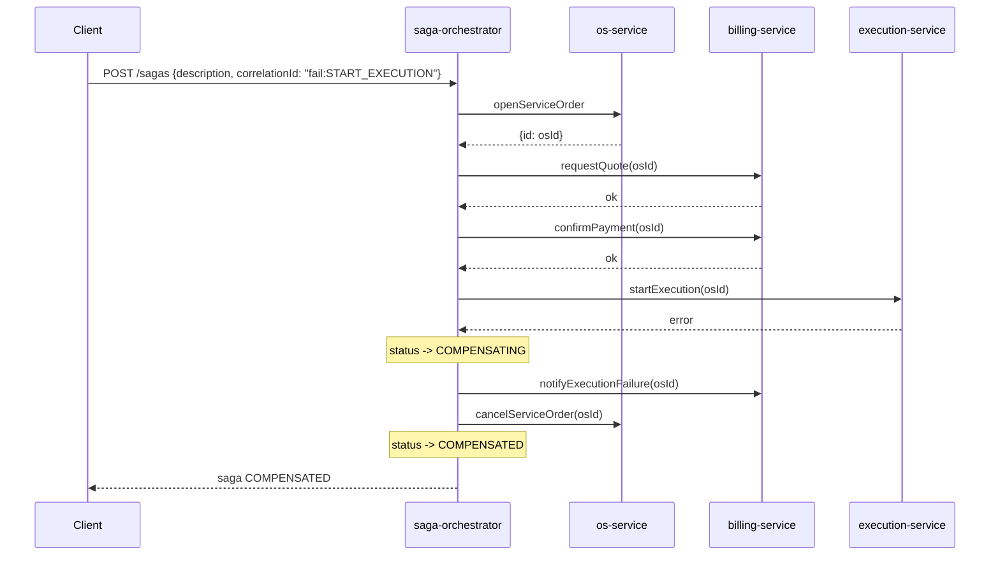

# Architecture — OS Service & Saga Orchestrator

Scope owned in this repo: **OS Service** (`os-service`) and the **Saga
Orchestrator** (`saga-orchestrator`). `billing-service` and `execution-service`
are owned by other teams; here they exist only as scaffolds/mocks so the saga
can be exercised end-to-end.

## Component diagram



## Saga strategy: Orchestrated (not Choreographed)

**Chosen: Orchestrated Saga.** A single coordinator (`saga-orchestrator`)
owns the flow definition, calls each participant with explicit commands, and
decides what to compensate when something fails.

Why orchestrated over choreographed, for this scope:

- **A single, ownable piece of business logic.** The flow (`OS → Orçamento →
  Execução`) and its compensations are the deliverable for this challenge.
  Orchestration keeps that logic in one place (`StartServiceOrderSagaUseCase`
  + `SagaCompensationService`) instead of scattered as implicit event
  reactions across three independently-owned services.
- **Explicit, inspectable state.** Every saga run is a `SagaInstance` row
  with a status and an ordered list of completed steps — `GET /sagas/:id`
  answers "where is this saga and what would be rolled back" directly.
  Choreography would require replaying/aggregating events across services to
  answer the same question.
- **No shared event bus required.** Billing and Execution are owned by other
  teams and, at the time of writing, don't exist as running services.
  Orchestration only requires each participant to expose a small HTTP
  contract (see ports below); choreography would additionally require a
  message broker and agreed event schemas across three teams before anything
  could be tested.
- **Trade-off accepted:** the orchestrator is a new coupling point and a
  potential bottleneck/SPOF. That's acceptable here because it is the
  component this delivery is explicitly responsible for building.

## The flow and its ports

`saga-orchestrator` depends on three ports (`application/ports/*.port.ts`),
each with a forward action and a compensating action:

| Step | Forward action (port method) | Compensating action |
|---|---|---|
| 1. Open OS | `OsServicePort.openServiceOrder` | `OsServicePort.cancelServiceOrder` |
| 2. Request quote | `BillingServicePort.requestQuote` | `BillingServicePort.cancelQuote` |
| 3. Confirm payment | `BillingServicePort.confirmPayment` | `BillingServicePort.notifyExecutionFailure` (refund path — payment already succeeded) |
| 4. Start execution | `ExecutionServicePort.startExecution` | `ExecutionServicePort.cancelExecution` |
| 5. Complete OS | `OsServicePort.updateStatus(COMPLETED)` | — (terminal step; a failure here still triggers steps 1-4's compensations) |

`OsServicePort` is implemented by `HttpOsServiceClient`, which calls the real
`os-service` HTTP API. `BillingServicePort` and `ExecutionServicePort` default
to in-process mocks (`infra/mocks/*`) — swap to the real HTTP clients
(`infra/clients/http-billing-service.client.ts`,
`infra/clients/http-execution-service.client.ts`) by setting
`USE_MOCK_DOWNSTREAM=false` once those teams' services are deployed.

## Compensation logic

`SagaCompensationService.compensate()` is the single place rollback happens.
It inspects `SagaInstance.getCompletedSteps()` and runs the matching
compensating actions **in reverse order**, best-effort (one failing
compensation is logged, not fatal — the remaining ones still run):

1. If execution had started → cancel it.
2. If payment had been confirmed → notify billing of the execution failure
   (refund path). Otherwise, if a quote had only been requested → cancel the
   quote.
3. Always cancel the service order last, if one was opened.

If the very first step (`openServiceOrder`) fails, nothing has happened yet,
so the saga goes straight to `FAILED` with no compensation to run.

## Sequence — happy path



## Sequence — failure and compensation



## Trying it locally

```bash
# terminal 1
cd microservices/os-service && npm run start:dev

# terminal 2
cd microservices/saga-orchestrator && npm run start:dev

# happy path
curl -X POST http://localhost:3020/api/v1/sagas \
  -H 'content-type: application/json' \
  -d '{"description":"Replace brake pads"}'

# force a compensation, e.g. at execution
curl -X POST http://localhost:3020/api/v1/sagas \
  -H 'content-type: application/json' \
  -d '{"description":"Replace brake pads","correlationId":"fail:START_EXECUTION"}'
```
